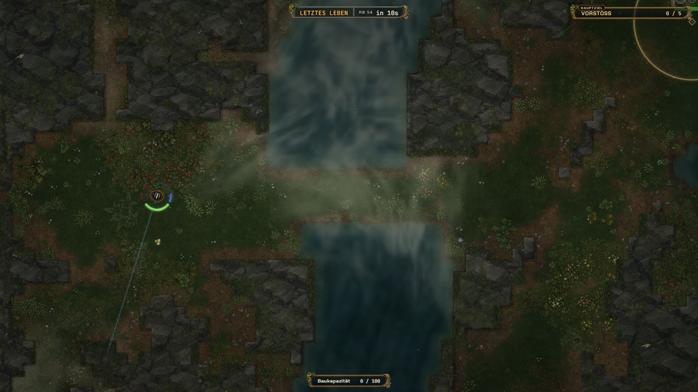

# Konzept: Reproduzierbare Sichtprüfungen in Fragdachse

Stand: 27.09.2026. Vorschlag auf Basis einer Browserprobe und gezielter Codeprüfung; keine implementierte Diagnosefunktion und keine beschlossene Architekturänderung.

## Ergebnis der Probe

Auftrag: Inspector Gadget auf Map 7, zweite Insel, Flammenturm im Gegnerkampf. Die tatsächlichen Content-IDs heißen `inspector_gadachs`, Map `7`, `flame_turret` und dessen Waffe `TURRET_FLAME`.

**Teilweise nachgestellt:** Map 7 wurde mit Inspector Gadachs gestartet; das Flammenturm-Upgrade wurde gekauft. Die zweite Insel, ein dort gebauter Turm und dessen Flammen im Kampf wurden nicht erreicht. Es gibt deshalb keine Aussage über die Qualität oder einen Fehler der Flammen. Der Turm war zudem noch nicht in das Utility-Rad aufgenommen: Freischalten und Ausrüsten sind getrennte Schritte.

Die Probe lief mit `npm run dev:browser` auf Port 8090 und dem sichtbaren Codex-Browser. Es wurden keine Gameplay-Dateien, Shader oder Testharnesses verändert. Claude Code wurde nicht selbst getestet; dessen Einschränkungen stammen aus dem Nutzerbericht.



| Schritt | Tatsächliche Beobachtung | Konsequenz |
|---|---|---|
| Serverstart | Vite meldete 452 ms, einschließlich Hinweis auf erneute Dependency-Optimierung. HTTP 200 anschließend bestätigt. | Serverbereitschaft ist kein Maß für Spielbereitschaft. |
| Erste Navigation | Browser-Navigation lief nach rund 15 s in einen Timeout. Der Tab existierte und lud weiter. Lobby nach ungefähr 45 s beobachtet. | Navigations-Timeout darf nicht automatisch einen weiteren Reload auslösen. |
| Aussagekraft der Startzeit | Einzelbeobachtung mit vorhandenem Browserprofil; keine kontrolliert cacheleere Messung. | Minutenlange Kaltstarts und die gemeldeten 985 Assets wurden hier nicht nachgemessen. |
| Ausgangsprofil | Level 23, 20.000 XP, ein Bosspunkt, nur Map 1 verfügbar. | Level und Kartenfortschritt sind unabhängig. |
| Klasse | Inspector erst bei entsprechendem Fortschritt bis Map 10 verfügbar. Map 7 allein genügt nicht. | Ein Szenario muss Klassen-, Karten- und Upgradezugang gemeinsam auflösen. |
| Menüs | Lobby und Upgradebaum erscheinen im Accessibility-Baum praktisch nur als Seite. HTML-Debugmenü liefert dagegen Felder, Optionen und Buttons. | Canvas-Koordinaten sind ein unnötiger Engpass für Testvorbereitung. |
| Klicks und Bilder | Mehrere Klicks ohne erwartete Wirkung bzw. auf benachbarte Bereiche; DOM-Maße und Screenshot passten zeitweise nicht zusammen. Nach festem 1920×1080-Viewport und frischer Aufnahme funktionierten die Upgrade-Klicks. | Tool-/Pane-Verhalten und Spielverhalten getrennt diagnostizieren; Bilder unmittelbar nach Resize können Übergangszustände zeigen. |
| Upgrade | Inspector auswählen, Konstruktionen öffnen, Turm kaufen; zusätzlich ist ein kleines Plus zum Ausrüsten erforderlich. | Gekauft, ausgerüstet, ausgewählt und gebaut müssen separat bestätigt werden. |
| Bewegung | Drei D-Tastendrücke erzeugten keinen sichtbar erkennbaren Ortswechsel. R blieb nicht gehalten, das Utility-Rad dadurch nicht offen. | Zeitlich definierte Spielbefehle statt OS-Tastendruckdauer. Kein Beleg, dass menschliche WASD-Steuerung defekt ist. |
| Tageszeit | M öffnete auf Map 7 ein bedienbares HTML-Panel mit 17:00, Slider und Auto-Schalter. | Vorhandene Funktion auffindbar machen und wiederverwenden. Andere Kontexte wurden nicht verifiziert. |
| Reload | Nach 3 s noch Vorbereitung, bei der nächsten Beobachtung nach 17 s Lobby. Wieder Map 10 statt aktiver Map-7-Mission. Inspector/Plasmabrenner blieben erhalten. | Reload verliert den Versuch; die Beobachtungsintervalle sind keine exakte Ladezeitmessung. |

Nach der Probe wurden das gekaufte Turm-Upgrade zurückgenommen, Dachs Nukem wieder gewählt und die Debug-Fortschrittswerte auf 20.000 XP, einen Bosspunkt und Map 1 gestellt. Ein byteidentischer Save-Rollback wurde nicht verifiziert. Gerade deshalb gehört Save-Isolation in den ersten Umsetzungsschritt.

## Ziel: Ein Szenario starten statt einen Spielstand vorbereiten

Ein Dev-Szenario beschreibt Welt, Activity, Seed, Klasse, Loadout, Upgrades, Items, Positionen, Ziele, Ressourcen und Aufnahmebedingungen. URL und HTML-Bedienung starten denselben Ablauf. Eine KI soll nach dem Öffnen einer URL lesen können, was vorbereitet wurde und warum der Versuch eventuell noch nicht bereit ist.

Beispiel einer **zukünftigen**, noch nicht vorhandenen URL:

```text
http://127.0.0.1:8090/?devScenario=map7-inspector-flame-island2
```

Das erste Preset soll genau den angefragten Fall umsetzen:

1. Isolierte lokale Host-Sitzung mit eigenem Diagnoseprofil öffnen.
2. Die reale World von Map 7 mit festem Seed und regulärer Missions-Activity laden.
3. Inspector, das Upgrade `unlock_flame_turret` und den Tool-Eintrag `{ kind: 'construction', id: 'flame_turret' }` über die existierenden Loadout-Resolver einstellen.
4. Einen geprüften Ort auf der zweiten Insel auflösen und Spieler/Kamera dort positionieren.
5. Den Turm über die reale Bauaktion platzieren, mit korrektem Owner, Baukapazität und gültiger Geometrie.
6. Definierte echte Gegner in Reichweite erzeugen und den normalen Zielwahl-, Angriffs-, Treffer- und Renderpfad laufen lassen.
7. Nach dem ersten bestätigten Turmtreffer eine definierte Anzahl Simulationsschritte weiterlaufen und auf Wunsch einfrieren.
8. Screenshot, Ausschnitt und Zustandsbericht anbieten. Ein Neustart stellt denselben Ausgangsfall wieder her.

„Zweite Insel“ ist bislang in dieser Untersuchung kein verifizierter maschinenlesbarer Anker. Das Preset darf keine Koordinate erfinden. Zunächst tatsächliches Layout und Seed prüfen, dann einen benannten Szenarioanker samt gültiger Stand-/Bauposition speichern. Anker und Layout-Fingerprint müssen zusammenpassen; bei Abweichung klar fehlschlagen. Ein Index über zufällig gefundene Landflächen ist kein stabiler Ersatz.

## Bedienung für Codex, Claude Code und Menschen

**Ein kleines HTML-Diagnosepanel ist der obligatorische Zugang.** Echte Labels, Buttons, Selects, numerische Felder, sichtbare Statusausgaben und Tastaturbedienbarkeit erlauben Browserautomation ohne versteckte JavaScript-Schreibzugriffe. Die in dieser Sitzung dokumentierte `evaluate`-Schnittstelle ist nur lesend; ein alleiniger `window.debug`-Zugang würde dieses Problem nicht lösen.

Ein optionales typisiertes Konsolenobjekt und später WebMCP können denselben Command-Handler aufrufen, sofern das jeweilige Tool sie unterstützt. Weder ein eigener MCP-Server noch neue Browserinfrastruktur sind für den ersten Schritt nötig.

| Bereich | Benötigte Bedienung |
|---|---|
| Szenario | Preset wählen, starten, neu starten, abbrechen; gültige Content-IDs suchen; JSON importieren/exportieren |
| Spieler | Klasse und konkrete Upgradelevel; Waffen und ausgewählte Utility-Slots; Items einschließlich ihrer aufgelösten Eigenschaften |
| Eingabe | Bewegung für N Simulationsschritte, Zielpunkt, Schießen an/aus oder für N Schritte, Dash, Utility direkt wählen und auslösen, alles stoppen |
| Ort | Teleport zu geprüftem Anker für Aufbau; Bewegung entlang einer Route für echte Navigationstests |
| Konstruktionen | Typ, Owner und Platzierung wählen; reale Bauaktion mit eindeutigem Ablehnungsgrund |
| Gegner | Konkrete Spezies, Anzahl, Position, KI aktiv/passiv; zusätzlich gepinnte, robuste Trainingsziele |
| Bedingungen | Unverwundbarkeit, Ressourcennachfüllung, automatische Wellen an/aus; sämtliche Abweichungen sichtbar im Bericht |
| Darstellung | Tageszeit, Kamera-Zoom, Kamera auf Entität, HUD anzeigen/verbergen, dokumentierte Qualitätsstufe |
| Zeit | Pause, Fortsetzen, feste Schritte, Zeitlupe, Neustart; Bereitschaft erst nach tatsächlich gerendertem Zielbild |
| Aufnahme | PNG in definierter Renderauflösung, Ausschnitt, Bildfolge mit Frame-/Zeitangaben und Zustands-JSON |

Ein Eingabebefehl braucht eine definierte Dauer oder expliziten Stop, einen exklusiven Diagnose-Input-Owner und automatisches Freigeben bei Abbruch, Reload, Worldwechsel oder Fehler. Dauerfeuer darf nach einem fehlgeschlagenen Toolaufruf nicht unbemerkt weiterlaufen. Teleport dient dem Aufbau und behauptet keine geprüfte Begehbarkeit des Weges.

Jeder Command erhält eine ID und ein Ergebnis wie `completed`, `rejected` oder `failed`, mit fachlichem Grund. Der lesbare Status enthält World-/Activity-Identität, Seed, Layout-Fingerprint, effektive Klasse/Loadout/Items, Spielerposition, Bauzustand, Zielzahl, Simulationsschritt und letzten gerenderten Frame. Kein „bereit“, solange nur der HTTP-Server antwortet oder Ziele und Renderer noch fehlen.

## Anschluss an bestehende Spielarchitektur

Die technische Grundlage ist bereits teilweise vorhanden:

| Vorhandener Einstieg | Nutzen und Grenze |
|---|---|
| [InputSystem](../src/systems/InputSystem.ts), `setDiagnosticInput` | Zielwinkel und anhaltender Waffentrigger; noch keine vollständige Bewegungs-/Utility-Schnittstelle. |
| [PerformanceLab gamePort](../src/debug/performanceLab/gamePort.ts) | Kombiniert Diagnosefeuer mit `bridge.sendLocalInput`, kontrollierten Positionen, Zielen, Ressourcen und Tageszeit. Wiederverwendbare Abläufe identifizieren. |
| [PerformanceLab loadouts](../src/debug/performanceLab/loadouts.ts) | Baut und validiert explizite Upgrade-/Loadout-Konfigurationen ohne manuelles Upgrade-Menü. |
| [NavigationLabPort](../src/debug/navigationLab/NavigationLabPort.ts) | Seed, Geometrie/Fingerprint, Spielerposition und konkrete Gegnerspawns sind bereits explizite Ports. |
| [ArenaRuntimeAdapters](../src/scenes/arena/ArenaRuntimeAdapters.ts) | Vorhandene Ziel-, Pinning- und Adrenalin-Anbindungen. Lifetime und Authority vor Wiederverwendung prüfen. |
| [TimeOfDayDebugOverlay](../src/ui/TimeOfDayDebugOverlay.ts) | Existierendes HTML-Panel und lokaler Licht-Override. |
| [PerformanceLab boot](../src/debug/performanceLab/boot.ts) | Startmarker und Zustände vorhanden, aber Sonderbuild mit festen Auflösungs-, Fokus- und Audiobedingungen. Nicht unverändert zum universellen Sichtprüfmodus erklären. |

Ein Dev-Controller orchestriert den Aufbau. Er erhält explizite Ports, keine beliebig beschreibbare ArenaScene. Simulation, Bauen, Treffer und Ressourcen bleiben bei ihren produktiven Host-Ownern. World, Activity und Round werden über den Lifecycle erzeugt und abgebaut; bei Abbruch werden Inputs, Listener, Overrides und temporäre Entitäten vollständig entfernt. Neue Läufe invalidieren alte Command-Antworten über eine Lauf-ID.

Das Ziel ist eine kleine gemeinsame Diagnoseschnittstelle für bereits benötigte Fähigkeiten, kein pauschaler Umbau aller Labs. Die strengen Messbedingungen des Performance-Labs bleiben eigenständig.

**Isolation zuerst:** Dev-Entry nur im expliziten Entwicklungs-/Diagnosebuild laden. URL-Parameter allein sind keine Zugriffskontrolle. Schreibende Aktionen nur in einer isolierten lokalen Host-Sitzung ohne fremde Teilnehmer. Diagnoseprofile und Test-Items dürfen nicht in normalen Progress, Belohnungen, persistenten Basen oder Cloud-/Browser-Saves landen. Reguläre Inhalts- und Loadout-Validierung bleibt aktiv; nur Progressionszugang wird im Diagnoseprofil kontrolliert bereitgestellt.

## Integrierter Versuch und Effekt-Lab

Beide Ansichten sind sinnvoll, aber ihre Nachweise unterscheiden sich:

- **Integrierter Versuch:** echte Map, echte Spieler-/Gegner-/Bau- und Schadenssysteme. Belegt, dass der Flammenturm unter den gewünschten Bedingungen tatsächlich feuert und trifft.
- **Effekt-Lab:** derselbe Renderer mit definierten Präsentationsdaten. Belegt Aussehen, Varianten und zeitliche Phasen, beispielsweise Tesla-Ladung, Überladung, Nova und violette Mini-Kuppel. Es belegt keinen ausgelösten Gameplay-Vorgang.

Das Effekt-Lab soll ein dauerhafter Modus derselben Diagnoseoberfläche werden. Es benötigt nur die Assets des gewählten Falls. Eine Mini-Kuppel kann dort direkt dargestellt werden; ihr tatsächlicher Teleporter-Auslöser braucht einen zusätzlichen integrierten Gegnerfall. Trainingsdummys auf dem Übungsplatz sind eine nützliche Erweiterung, ersetzen aber weder reale Gegnerspezies noch die zweite Insel.

Für Pause/Einzelschritt reicht `scene.time.timeScale` allein nicht als zugesicherter Vertrag. Physik, Hostsimulation, Input, Scheduler, Tweens, Partikel und Shaderzeit müssen für den unterstützten Fall gemeinsam kontrolliert werden. Bereits Tesla-Renderer lesen `scene.time.now`; das Performance-Lab verwendet zusätzlich `performance.now`. Zunächst einen begrenzten, getesteten Zeitvertrag für den Pilotfall schaffen. Ein Seed allein garantiert weder identische Partikel noch GPU-pixelidentische Bilder.

Kurze Ereignisse werden im Spielablauf erfasst: „nach bestätigtem Ereignis plus N Schritte aufnehmen“, ergänzt um eine Bildfolge über das Ereignis. Tool-Latenz entscheidet dann nicht mehr, ob die 190-ms-Phase getroffen wird.

## Reload und Startzeit

**Erster Hebel: das Szenario nach Reload erneut aufbauen.** URL/Preset und letzte Diagnosekonfiguration bleiben erhalten; ein Reload führt zurück zum gleichen vorbereiteten Fall. Zunächst Ausgangszustand reproduzieren, kein beliebiges Save-State-System für mitten im Kampf laufende Physik bauen.

Gezieltes Shader-HMR folgt später: nur bekannte Shader-/Renderparameter ersetzen, Ressourcen korrekt entsorgen und bei inkompatiblen Änderungen das Szenario neu starten. Im untersuchten `src` wurde kein `import.meta.hot`-Handler gefunden. Allgemeines Scene-Hot-Reload wäre ein deutlich größerer Auftrag.

Die Startzeit separat vermessen:

1. Prozessstart bis HTTP-Bereitschaft.
2. Navigation bis Modulgraph/Boot-Eintritt.
3. Contentvalidierung, Raumverbindung und Schriften.
4. Assetdownload, Dekodierung und Verarbeitung.
5. World-/Systemaufbau, Shader-/Texturarbeit und erster gerenderter Frame.
6. Szenarioaufbau bis fachlich bestätigter und sichtbarer Bereitschaft.

Mehrere vergleichbare Kalt- und Warmläufe mit dokumentiertem Cachezustand, Profil, Renderauflösung und Fokus erfassen. Blockierte Phasen mit Ursache anzeigen statt auf einen Ladebalken zu vertrauen. Bestehende Marker und Boot-Loader-Beobachtung erweitern.

Bereits vorhanden sind `optimizeDeps.entries`, Vite-Warmup für `main.ts` und `ArenaScene.ts` sowie Watch-Ausschlüsse. Diese Maßnahmen nicht erneut als neue Lösung verkaufen. `main.ts` wartet vor Phaser auf `NetworkBridge.connect()`; das kann unabhängig von Assets Zeit kosten. `ArenaScene.preload` lädt Audio, Umgebung, Figuren, Waffen-/Upgrade-Icons und weitere Gruppen breit vor.

Danach nach Messbefund optimieren: Diagnosecode erst bei Bedarf importieren; Assetgruppen nach Lobby, ausgewählter World und Szenario laden; große Bilder/Audio und Decode-Kosten gesondert untersuchen; kleinen Renderer-Lab-Entry vom kompletten Arena-Importgraph trennen. Shared-Assets müssen vor ihrer ersten Verwendung verfügbar bleiben. Ein optionaler lokal gebündelter Diagnosebuild kann wiederholte Modultransformation vermeiden, ersetzt aber keine Messung des normalen Devstarts. Offline-Hostbetrieb wäre bei nachgewiesenem Verbindungsengpass eine gesonderte Erweiterung an der vorhandenen Netzwerkgrenze.

## Priorisierte Umsetzung und Abnahme

| Phase | Lieferumfang | Überprüfbarer Erfolg |
|---|---|---|
| 1: Pilot im echten Spiel | Save-Isolation, Dev-Gating, HTML-Panel, genau das Map-7-Preset, geprüfter Inselanker, gültiges Inspector-Loadout inklusive Tool-Slot, Turmbau, echte Gegner, Status und Reset | Frisches Browserprofil braucht keine Cheats oder Menü-Navigation; Turm steht auf bestätigter Insel, wählt Ziel, feuert und verursacht bestätigten Treffer. |
| 2: Wiederholbarkeit | Bewegungs-/Feuerbefehle, Ereignisaufnahme, Kamera/Licht, Reload-Wiederaufbau, sauberes Cancel | Zehn aufeinanderfolgende Starts/Resets ohne verlorene Inputs oder alte Entitäten; Reload erreicht wieder denselben geprüften Aufbau. |
| 3: Visuelle Werkzeuge | Begrenzter Zeitvertrag, Pause/Schritt/Zeitlupe, definierte PNG-Ausgabe und Ausschnitt, Effekt-Lab, Dummy-Presets | Nova-/Überladungsphasen gezielt aufnehmen; integrierte und synthetische Nachweise sind im Bericht unterscheidbar. |
| 4: Startoptimierung | Phasenmessung, priorisierte Ladegruppen/Importgrenzen, gegebenenfalls gezieltes Shader-HMR | Gemessene Verbesserung gegen dieselbe Ausgangsmessung; auch fehlende Assets und Abbruchfälle sind diagnostizierbar. |

Planungsziele, noch keine Zusage: nach erreichter Spielbereitschaft maximal zwei semantische UI-Aktionen zum Versuch; warmer Szenario-Reset möglichst unter fünf Sekunden; Bildaufnahme ohne manuelles Timing. Eine belastbare Kaltstart-Zielzeit erst nach Messung festlegen.

Tests schützen Schemafehler, wirksames Loadout statt stiller Sanitizer-Verluste, Save-Isolation, Host-/Build-Gating, Lifecycle-Cleanup, Command-Reihenfolge und fachliche Aufnahmebedingungen. Vorhandene Core-/Integration-/Lab-Suites erweitern; keine neuen Screenshot-Goldens für ästhetische Pixelwerte. Der Pilot wird anschließend in Codex **und** Claude Code über dieselbe URL und HTML-Oberfläche abgenommen.

Die nächste Umsetzung sollte mit Phase 1 beginnen. Sie beseitigt den größten Zeitverlust und liefert einen realen Integrationsfall, an dem weitere Werkzeuge ihren Nutzen nachweisen können.
